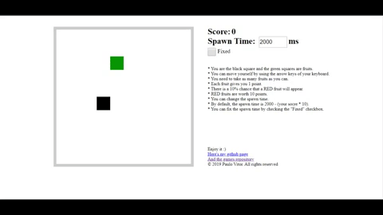

# SimpleGame
A simple game to train JavaScript concepts.

### Here's a demonstration:

  </img>

## How to play
1 - Clone or download this repository  
2 - Open the index.html file with any browser  
3 - Follow the instructions below :)

### Instructions

* You are the black square and the green squares are fruits.
* You can move yourself by using the arrow keys of your keyboard.
* You need to take as many fruits as you can.
* Each fruit gives you 1 point.
* There is a 10% chance that a RED fruit will appear.
* RED fruits are worth 10 points.
* You can change the spawn time.
* By default, the spawn time is 2000 - (your socre * 10).
* You can fix the spawn time by checking the "Fixed" checkbox.
